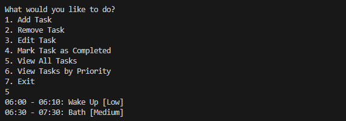
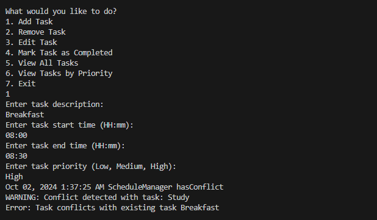
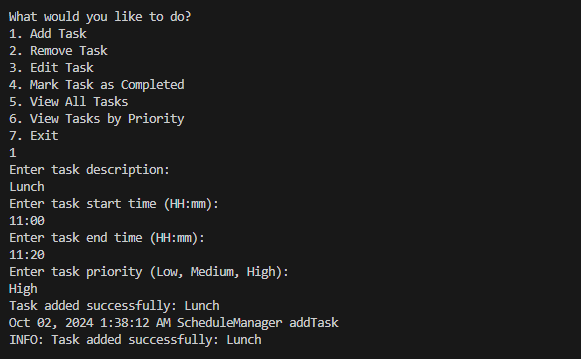

# EI Stydy Task

## Exercise 1: Design Patterns in Java

This section covers six use cases of software design patterns grouped into **Behavioral**, **Creational**, and **Structural** patterns. Each use case includes a practical Java example.

### 1. Behavioral Design Patterns

#### 1.1 Command Pattern: Remote Control System
**File:** `CommandPatternDemo.java`

The **Command Pattern** encapsulates requests as objects, allowing for parameterization and logging of different requests. Example: A remote control used to turn a light on/off where each action is represented as a command.

---

#### 1.2 Observer Pattern: Stock Price Updates
**File:** `ObserverPatternDemo.java`

The **Observer Pattern** defines a one-to-many relationship where observers are notified of changes in the subject. Example: Users being notified of stock price updates when the price changes.

---

### 2. Creational Design Patterns

#### 2.1 Singleton Pattern: Database Connection
**File:** `SingletonPatternDemo.java`

The **Singleton Pattern** ensures only one instance of a class is created and provides a global point of access to it. Example: A database connection manager that ensures only one instance of the connection is created.

---

#### 2.2 Factory Pattern: Vehicle Factory
**File:** `FactoryPatternDemo.java`

The **Factory Pattern** defines an interface for creating objects but allows subclasses to decide which class to instantiate. Example: A vehicle factory that creates cars or bikes based on user input.

---

### 3. Structural Design Patterns

#### 3.1 Adapter Pattern: Media Player
**File:** `AdapterPatternDemo.java`

The **Adapter Pattern** allows incompatible interfaces to work together. Example: A media player that supports MP3 is adapted to also support MP4 files.

---

#### 3.2 Decorator Pattern: Coffee Shop
**File:** `DecoratorPatternDemo.java`

The **Decorator Pattern** dynamically adds functionality to an object. Example: Adding ingredients (milk, sugar) to a coffee without modifying the coffee object itself.

---

## Exercise 2: Astronaut Daily Schedule Organizer

This section outlines a console-based CRUD application that helps astronauts organize their daily schedules with proper design patterns, validation, and error handling.

### Key Features
- **Add a Task**: Create a new task with a description, start time, end time, and priority.
- **Remove a Task**: Delete an existing task.
- **View All Tasks**: Display all tasks sorted by start time.
- **Prevent Task Overlap**: Ensure new tasks do not overlap with existing tasks.
- **Mark Tasks as Completed**: Mark tasks as completed when done.
- **View by Priority**: View tasks filtered by priority level.

### Design Patterns Used
1. **Singleton Pattern**: 
   - **Class:** `ScheduleManager`
   - Ensures only one instance of the schedule manager is responsible for managing tasks.
   
2. **Factory Pattern**: 
   - **Class:** `TaskFactory`
   - Centralizes task creation for flexibility and scalability.
   
3. **Observer Pattern**: 
   - **Class:** `TaskConflictObserver`
   - Notifies users of conflicts when a new task overlaps with existing tasks.

---

### Sample Inputs & Outputs Screenshots

**Adding a task**  

---

**Adding another task**  

---

**Viewing all tasks**  

---

**Removing a Task**  

---

**Editing a Task**  

---

**Adding another Task**  

---

**Mark Task as Completed**  

---

**Adding new Task(Conflict Occured with existing task)**  

---

**Adding new Task again**  

---

**Adding new Task again**  

---

**Viewing all Tasks**  

---

### Conclusion
This project effectively demonstrates the use of **Behavioral**, **Creational**, and **Structural** design patterns in real-world applications, following best practices such as **Singleton**, **Factory**, and **Observer** patterns in the **Astronaut Daily Schedule Organizer**.
